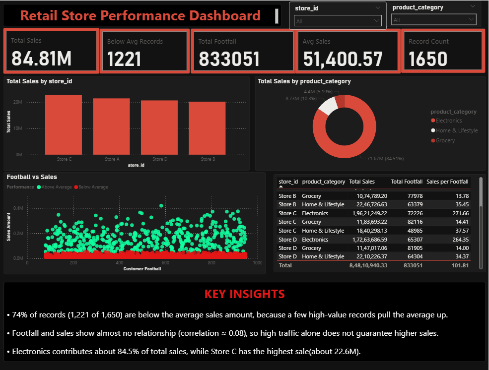

# Retail Store Performance Dashboard

A Power BI dashboard built on 1,650 retail records, using MySQL for data analysis and DAX for measures.

## View the Dashboard

- [Download Power BI file (.pbix)](Retail_Store_Performance.pbix) (open in Power BI Desktop)
- [View dashboard (PDF)](retail_analysis_dashboard.pdf)
- [SQL queries](retail_analysis.sql)

  

## Tools

  
 data profiling, store and category analysis, below-average records
  
interactive dashboard connected to the MySQL database
  
measures for Total Sales, Avg Sales, Below Avg Records, Sales per Football

## Dataset
1,650 records (Jan to Dec 2025) across 4 stores (A, B, C, D) and 3 categories (Grocery, Electronics, Home & Lifestyle). Columns: store, region, category, product, date, quantity sold, sales amount, customer footfall, inventory units, inventory value, inventory turnover.

## Key Findings
- 1,221 of 1,650 records (74%) are below the average sales amount, because a few high-value records pull the average up.
- Footfall and sales show almost no relationship (correlation about 0.08), so high traffic alone does not guarantee higher sales.
- Electronics contributes about 84.5% of total sales. Store C has the highest sales (about 22.6M).

## Files
- `Retail_Store_Performance.pbix`: Power BI dashboard
- `retail_analysis.sql`: SQL queries
- `Retail_Store_Performance_1650.csv`: dataset
- `dashboard.png`: dashboard screenshot
